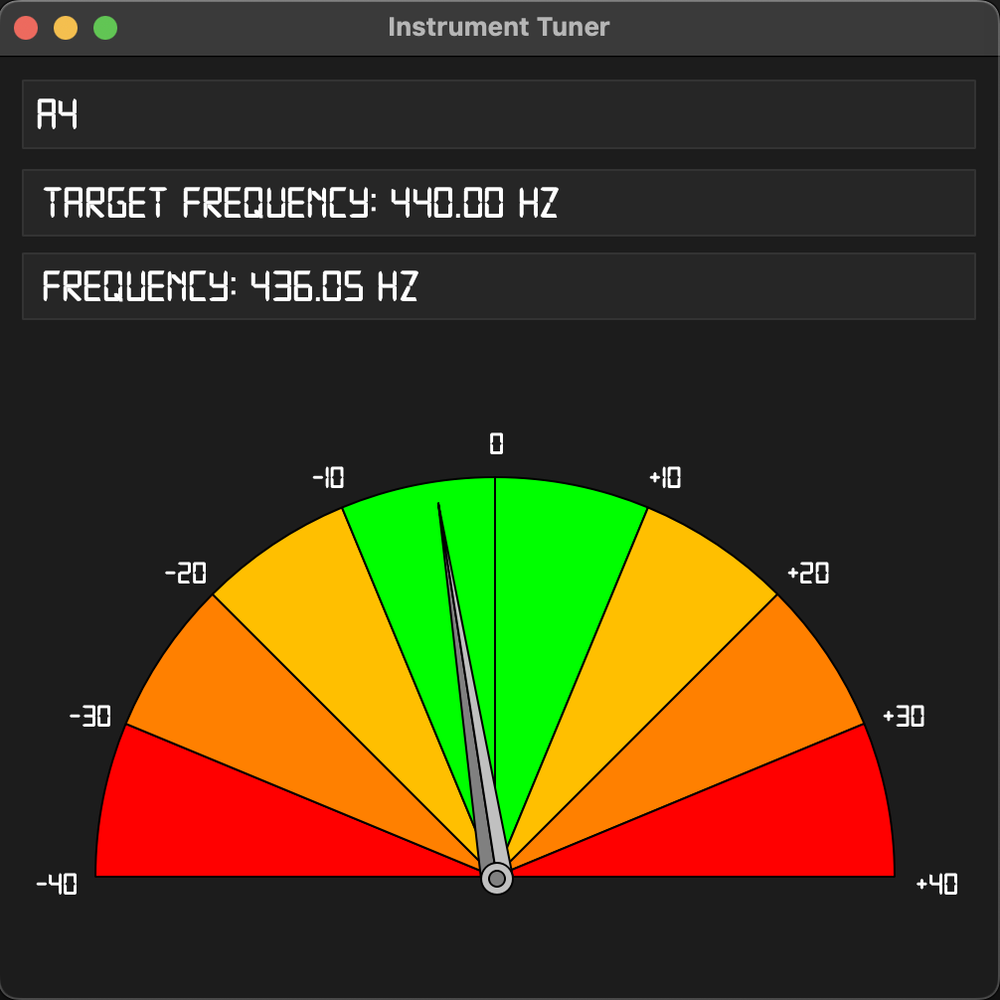

<h1>Instrument Tuner</h1>

A chromatic instrument tuner capable of tuning a wide variety of instruments with precision.

---

<h3>Origins</h3>

The motivation was to be able to tune my own violin. A proof-of-concept was developed using C++, PortAudio and FFTW and can be found <a href="https://github.com/farzanmirshekari/tuner_poc">here</a>.

---

<h3>How to run the tuner</h3>

First, install the required dependencies:

~~~
pip install -r requirements.txt
~~~

Then, launch the tuner:

```bash
python Application.py
```
---

<h3>How to use the tuner</h3>

1. Enter the note you want to tune to in the top text box (e.g. `A4`, `C#3`, `G5`, etc.).
2. Play the note on your instrument.
3. Adjust your pitch until the speedometer needle is in the center of the gauge.

As seen in the image below, the speedometer needle will move to the left if the pitch is too low, and to the right if the pitch is too high. The labels on the gauge indicate how far off the pitch is from the desired note. The desired frequency is displayed in the second text box.



---

<i>Developed and maintained by Farzan Mirshekari</i>
